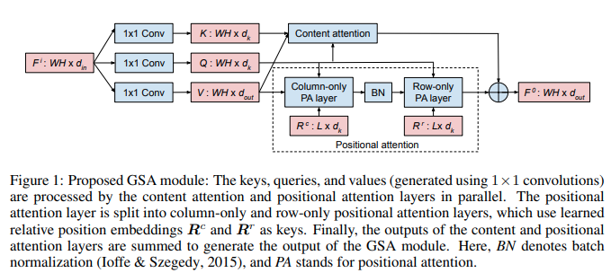

</img>

## Global Self-attention Network

An implementation of <a href="https://openreview.net/forum?id=KiFeuZu24k">Global Self-Attention Network</a>, which proposes an all-attention vision backbone that achieves better results than convolutions with less parameters and compute.

They use a previously discovered <a href="https://arxiv.org/abs/1812.01243">linear attention variant</a> with a small modification for further gains (no normalization of the queries), paired with relative positional attention, computed axially for efficiency.

The result is an extremely simple circuit composed of 8 einsums, 1 softmax, and normalization.

## Install

```bash
$ pip install gsa-pytorch
```

## Usage

```python
import torch
from gsa_pytorch import GSA

gsa = GSA(
    dim = 3,
    dim_out = 64,
    dim_key = 32,
    heads = 8,
    rel_pos_length = 256  # in paper, set to max(height, width). you can also turn this off by omitting this line
)

x = torch.randn(1, 3, 256, 256)
gsa(x) # (1, 64, 256, 256)
```

## Citations

```bibtex
@inproceedings{
    anonymous2021global,
    title={Global Self-Attention Networks},
    author={Anonymous},
    booktitle={Submitted to International Conference on Learning Representations},
    year={2021},
    url={https://openreview.net/forum?id=KiFeuZu24k},
    note={under review}
}
```
